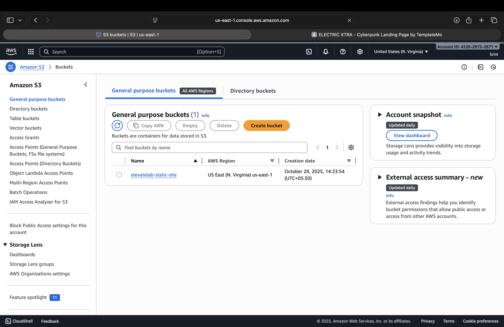
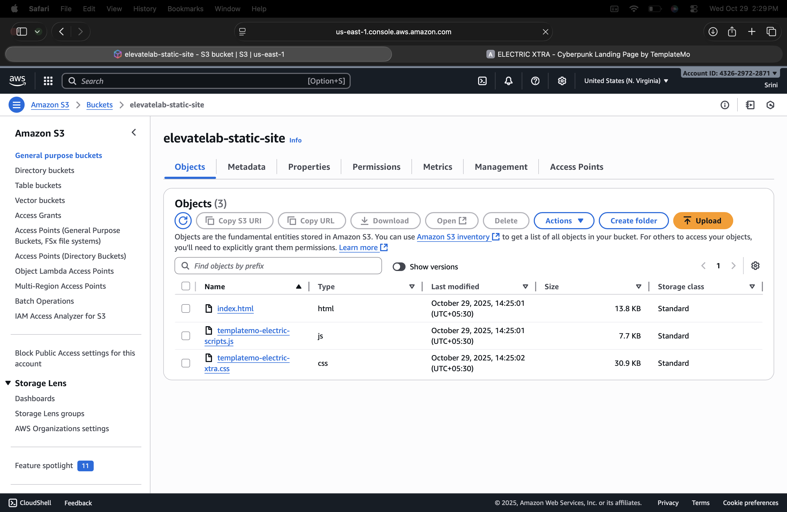
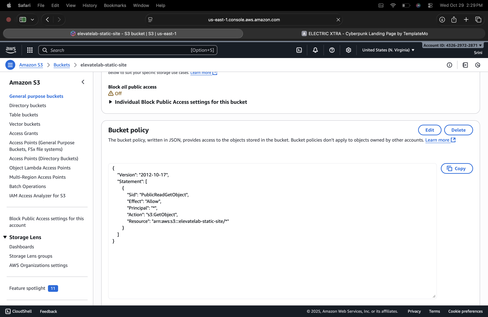
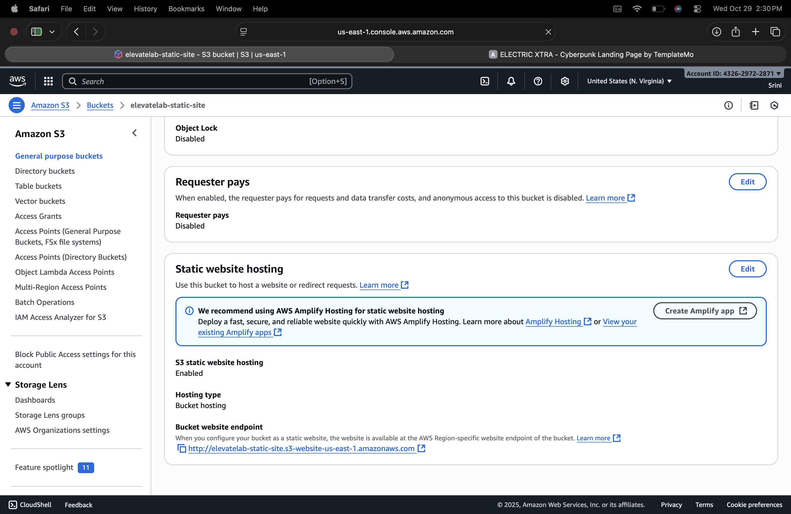
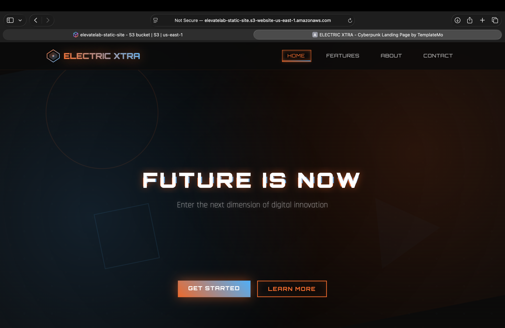
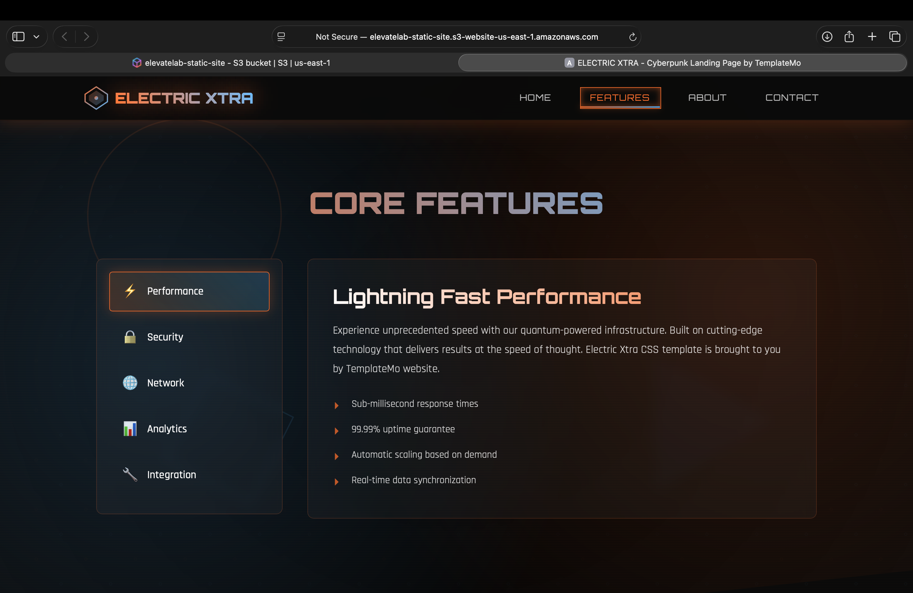

# ElevateLab Task 6 — Static Website Hosting on AWS S3

---

## Objective

To host a **static website** on **Amazon S3** using AWS Free Tier.  
This task demonstrates how to create an S3 bucket, configure permissions, enable static website hosting, and access the website via a public URL.

---

## Learning Outcomes

By completing this project, I learned to:

- Create and configure an **S3 bucket**
- Enable **Static Website Hosting**
- Manage **public access permissions**
- Deploy and test a **website on AWS Cloud**

---

## Tools & Resources Used

- **AWS S3 Console (Free Tier)**
- **HTML / CSS** (Static Website)
- **Web Browser** (for testing)
- **VS Code** (for editing files)

---

## Step-by-Step Implementation

### 1. Create an S3 Bucket**

1. Log in to the **AWS Management Console**.
2. Navigate to **S3 → Create bucket**.
3. Enter:
   - **Bucket name:** `elevatelab-static-site`
   - **Region:** `us-east-1` (virginia)
4. Uncheck **Block all public access** → Confirm warning.
5. Click **Create bucket**.

*Screenshot:* 



---

### 2. Upload Website Files**

1. Open your created bucket.
2. Click **Upload → Add Files**.
3. Upload your website files:
   - `index.html`
   - `style.css`
   - `File.js`
4. Click **Upload** to complete.

*Screenshot:* 



---

### 3. Enable Static Website Hosting**

1. Go to the **Properties** tab.
2. Scroll down to **Static website hosting**.
3. Click **Edit** → Select **Enable**.
4. Set:
   - **Index document:** `index.html`
   - *(Optional)* **Error document:** `error.html`
5. Click **Save changes**.

*Screenshot:* 



---

### 4. Configure Bucket Policy for Public Access**

1. Go to **Permissions → Bucket Policy**.
2. Add the following JSON (replace with your bucket name):

```json
{
  "Version": "2012-10-17",
  "Statement": [
    {
      "Sid": "PublicReadGetObject",
      "Effect": "Allow",
      "Principal": "*",
      "Action": "s3:GetObject",
      "Resource": "arn:aws:s3:::elevatelab-static-site-<yourname>/*"
    }
  ]
}
```

3. Save the policy.

📸 *Screenshot:* 



---

# 5. Test the Hosted Website

1. Go to **Properties → Static website hosting**.
2. Copy your **Bucket Website Endpoint**, e.g

**Website**

```
http://elevatelab-static-site.s3-website-us-east-1.amazonaws.com
```
3. Open it in a browser — your static site should appear!
   
📸 *Screenshot:*






